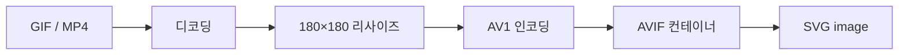

# Mini Profile

프로필 사진을 저용량으로 압축해줍니다.

## 작동 원리

```mermaid
flowchart LR
  A[GIF / MP4] --> B[디코딩]
  B --> C[180×180 리사이즈]
  C --> D[AV1 인코딩]
  D --> E[AVIF 컨테이너]
  E --> F[SVG image]
```

1. GIF / MP4 파일을 디코딩합니다.
2. 디코딩된 영상을 180×180으로 리사이즈합니다.
3. AV1 코덱으로 인코딩합니다.
4. 인코딩된 동영상을 AVIF으로 저장합니다.
5. AVIF를 data url로 SVG `<image>`에 넣습니다.
